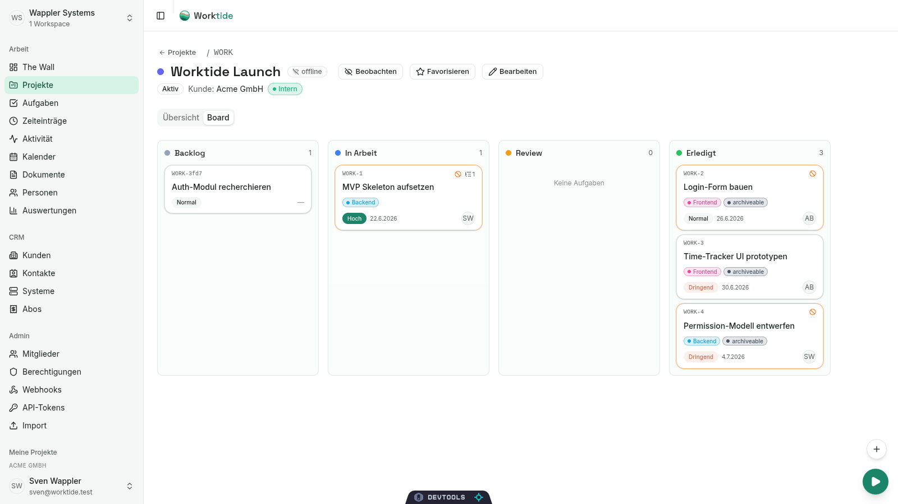
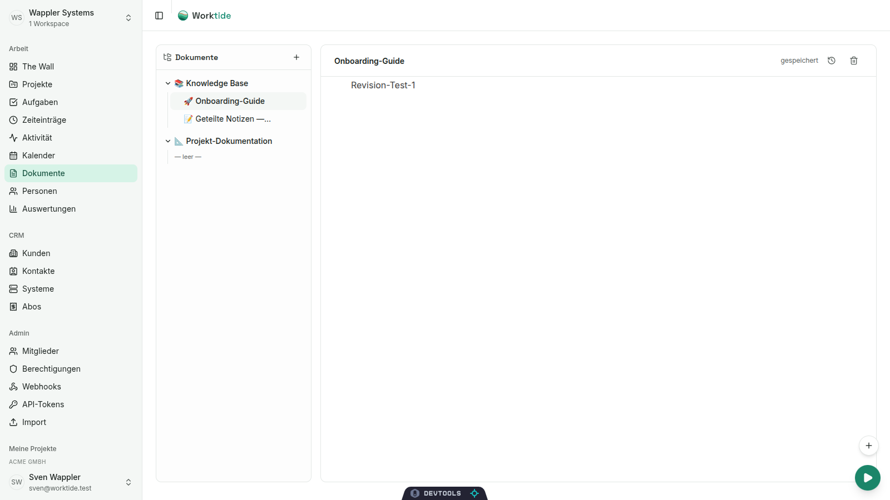
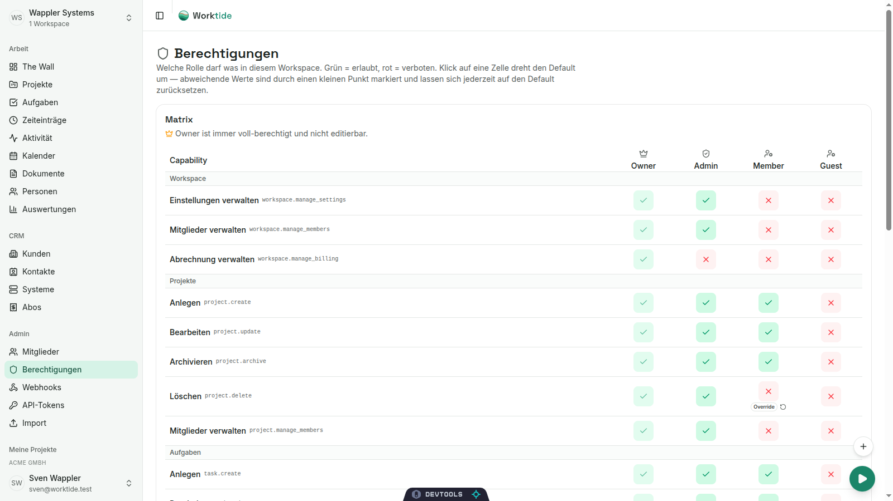
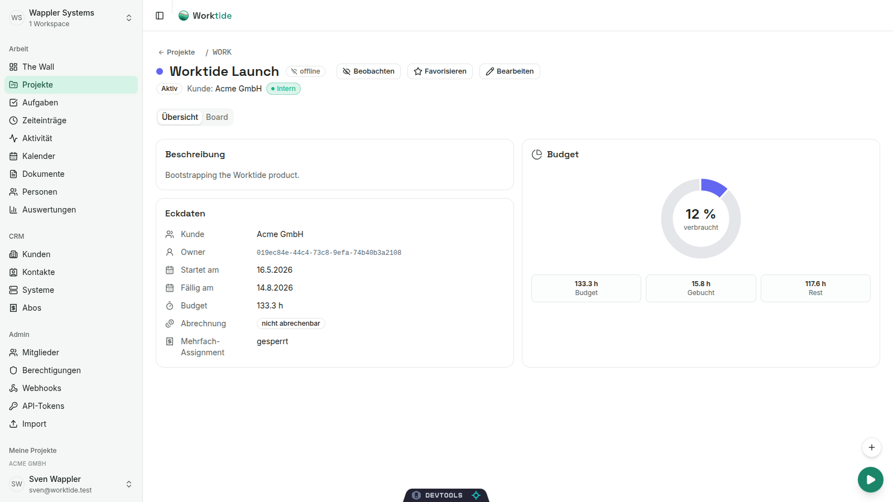

# Worktide

> Open-source project, task, time and CRM management — a functional hybrid of
> awork, Redmine and Confluence, built on Symfony 8 with a clean REST API and
> a React 19 SPA. Plus an MCP server so AI agents (Claude Code, Claude
> Desktop, …) can work *with* your projects.

Worktide is being developed as a self-hostable replacement for the
WapplerSystems agency stack: project tracking, task boards with subtasks +
dependencies, time logging, retainers, automations, a wiki with a
block-editor, a tag system, role permission matrix, CRM with customer
systems & service subscriptions, document revisions, personal access
tokens, plus a Model-Context-Protocol server with 18 tools.

## Screenshots

| | |
|---|---|
|  |  |
| Project board — kanban with tags, subtask counts, "blocked-by" indicators, drag-drop status changes. | Wiki-style docs — BlockNote editor with `/`-commands, nested page tree, autosave + revision history. |
|  |  |
| Role × Capability permission matrix. Toggle a cell → workspace override; the small "Override" badge + reset arrow restore the default. | Per-project budget donut. Colour shifts at 80% / 100% so over-budget projects can't hide. |

## Status

Phase 2 fully landed + awork-sweep closed + CRM-1/2 shipped. **Phase 3 (CRM
deepening + Docs + AI groundwork) underway.** Late-2026 the data model has
been validated against a real awork account (10 projects, 218 tasks
round-tripped through the public API with voter isolation + webhook delivery).

**AI agents are live (human-in-the-loop):** an `AIRecommendation` seam +
`RecommendationApplier` + a pluggable `LlmProviderInterface` power ticket
triage, marketing drafts, upgrade outreach, a **research/acquisition agent**
(missions → clarifying dialog → external search → lead pipeline) and a
**universal agent-action layer** (the LLM plans actions, one generic executor
runs them via the connector registry, every outbound call gated by
`EgressGuard`). Global full-text search runs on Meilisearch (MySQL fallback).

| Block | Feature | Status |
|---|---|---|
| Phase 1 | Workspace/Project/Task/TimeEntry foundations, JWT auth, voters | ✓ |
| B1 | Polymorphic comments + activity feeds | ✓ |
| B2 | Task lists + checklist items | ✓ |
| B3 | Task dependencies (4 PM types) + project milestones | ✓ |
| B4 | Polymorphic file attachments + versioning | ✓ |
| B5 | Project + Task templates | ✓ |
| B6 | Workflow automation + recurring schedules | ✓ |
| B7 | Workforce: Teams, Absences, UserCapacity, TypeOfWork | ✓ |
| B8 | Reporting endpoints + Autopilot alerts | ✓ |
| B9 | Wiki-style documents (Spaces, Contributors, hierarchical) | ✓ |
| B10 | Outbound HMAC-signed webhooks with async retry | ✓ |
| B11 | Granular per-role permissions with workspace overrides | ✓ |
| Sweep | Personal Access Tokens, Workspace Invitations, Active Timer + Private Tasks, Time Tracking Settings | ✓ |
| CRM-1 | Customer + Contact entities, Project.customer FK, awork-companies backfill | ✓ |
| CRM-2 | CustomerSystem (TYPO3/WP/...) + ServiceSubscription with auto-computed next-billing | ✓ |
| Sec-1 | Login throttling, auth audit log, password policy, refresh-token rotation | ✓ |
| Sec-2 | "Remember me" session, idle-logout, active-session list + revocation | ✓ |
| Sec-3 | Per-workspace JWT-TTL override | ✓ |
| Tag-1 | Workspace-wide tagging (project / task / customer / any) with picker + filter + management UI | ✓ |
| Subtasks | Self-referential parent-task + UI tree | ✓ |
| Dependencies | 4 PM dependency types (FS / SS / FF / SF) + lag minutes, cycle detection | ✓ |
| Docs-A | BlockNote rich-text editor, page tree, autosave, revision history with restore | ✓ |
| Perms-UI | Role × capability matrix with toggle + override + reset to default | ✓ |
| MCP | Standalone MCP server exposing 18 tools (`tasks.*`, `projects.*`, `time.*`, `me.*`) | ✓ |

Code at this point: 50+ entities, 17+ enums, 22+ API controllers, 14+ voters,
a comprehensive DataFixtures seed, Doctrine middleware for UUID-FK binding,
domain-event log auto-populated from Doctrine, an awork importer + a Personal
Access Token authenticator decoupled from the JWT firewall.

## Stack

- **PHP 8.4** / **Symfony 8.1** / **API Platform 4.3**
- **MySQL 8.0** via Doctrine ORM 3.6
- **UUIDv7** primary keys (`symfony/uid`) stored as `BINARY(16)`
- **JWT** auth via `lexik/jwt-authentication-bundle` + refresh tokens via
  `gesdinet/jwt-refresh-token-bundle`
- **Flysystem** for file storage (local adapter by default, S3-swappable)
- **Symfony Messenger** with Doctrine transport for async webhook delivery
- **DDEV** for local development

## Architecture highlights

### Multi-tenancy by default
Every domain entity uses `WorkspaceScopedTrait`. Workspaces isolate users,
projects, tasks, billing, automations — Voters enforce membership-based
authorization at API-Platform-resource level.

### Polymorphic targets
Comments, files, custom-field values and webhooks attach to multiple
aggregate types via `target` enum + `targetId` UUID rather than per-type
join tables — fewer schemas, simpler filters.

### Domain event log
`DomainEventEmitterSubscriber` listens on Doctrine's `onFlush` and writes an
immutable row to `domain_events` for every tracked entity (~30 currently).
Same events feed:
- the activity-feed UI,
- workflow automations,
- and outbound webhook subscribers (B10).

### Outbound webhooks
Workspace-scoped subscribers receive HMAC-SHA256-signed POSTs when matching
events fire. Auto-deactivate after consecutive failures; delivery log keeps
the full attempt history.

### awork importer
Read-only Bearer-token snapshot from `api.awork.com`, idempotent replication
into Worktide via `(externalSource='awork', externalId='aw:<uuid>')` —
seconds→minutes conversion, per-project taskstatuses collapsed to workspace
scope, multi-assignment preserved, external contacts skipped.

## Local development

### Bring up the stack

```bash
ddev start
ddev composer install
ddev exec php bin/console doctrine:migrations:migrate --no-interaction
ddev exec php bin/console doctrine:fixtures:load --no-interaction
```

Frontend: <https://worktide.ddev.site>
API: <https://api.worktide.ddev.site/v1/>

### Get a JWT

```bash
TOKEN=$(curl -s -X POST https://api.worktide.ddev.site/v1/auth/login \
  -H 'Content-Type: application/json' \
  -d '{"email":"sven@worktide.test","password":"demo"}' \
  | jq -r .token)
```

Demo users (all password `demo`): `sven@worktide.test` (Owner),
`alex@worktide.test`, `mira@worktide.test`, `tom@worktide.test`.

### Sample requests

```bash
# List projects in the demo workspace
curl -s -H "Authorization: Bearer $TOKEN" \
  "https://api.worktide.ddev.site/v1/projects" | jq

# Create a task
curl -s -X POST -H "Authorization: Bearer $TOKEN" \
  -H 'Content-Type: application/ld+json' \
  -d '{"workspace":"/v1/workspaces/<uuid>","project":"/v1/projects/<uuid>","identifier":"WORK-100","title":"Example","status":"/v1/task_statuses/<uuid>","priority":"normal"}' \
  https://api.worktide.ddev.site/v1/tasks | jq
```

OpenAPI docs are exposed at <https://api.worktide.ddev.site/v1/docs>.

### Async workers

The Messenger `async` transport carries outbound webhooks (and any future
deferred work). Consume it locally with:

```bash
ddev exec php bin/console messenger:consume async -vv
```

Slow, expensive AI/agent jobs (e.g. ticket triage) run on a **separate**
`ai_agents` transport so they can't starve the fast `async` queue. Run a
dedicated low-concurrency worker for it (in production, supervise it with
`--time-limit`/`--memory-limit` + auto-restart):

```bash
ddev exec php bin/console messenger:consume ai_agents -vv
```

### Import data from awork

Read-only snapshot followed by an idempotent replicate into a dedicated
workspace.

```bash
# Token must already exist in ~/.config/awork-token (chmod 600).
bash var/awork-snapshot/pull.sh                  # pull → var/awork-snapshot/*.json
ddev exec php bin/console app:awork:import       # import into a "WapplerSystems (awork)" workspace
ddev exec php bin/console app:user:reset-password admin@example.com demo
```

See `src/Command/AworkImportCommand.php` for the field-by-field mapping.

### Useful console commands

```bash
ddev exec php bin/console debug:router            # all routes
ddev exec php bin/console doctrine:schema:validate
ddev exec php bin/console app:tasks:run-schedules # materialise due TaskSchedules
ddev exec php bin/console app:autopilots:evaluate # fire alert rules
ddev exec php bin/console worktide:priority:recompute        # WSJF-lite ticket scores (nightly)
ddev exec php bin/console worktide:search:reindex            # rebuild the Meilisearch index
ddev exec php bin/console worktide:research:suggest          # proactive research-mission suggestions
```

## Roadmap

Short-term:
- Document Backlinks ("This page is referenced by …") + Mentions
- Inline-comments on a text selection in the wiki
- ✓ Global search (Meilisearch + MySQL fallback, `SearchProviderInterface`, Cmd+/)
- TypeScript / Dart OpenAPI clients published from CI

Phase 3 (CRM + Integrations):
- ✓ CRM-1: Customer + Contact entities, Project.customer link
- ✓ CRM-2: CustomerSystem + ServiceSubscription with nextBillingOn
- ✓ Tag system (project / task / customer / any) with picker + filter + management UI
- ✓ Permission matrix UI (role × capability + overrides + reset)
- ✓ Personal Access Tokens with one-shot reveal + Sicherheit-Tab (sessions list, idle-logout)
- ✓ MCP server (`worktide-mcp`, Node/TypeScript, 18 tools)
- CRM-3: TYPO3 customer portal so clients can see booked systems + services + invoices
- CRM-4: Invoice + Billing cycle (turn nextBillingOn into actual invoices)
- OAuth-per-workspace external system links (Lexoffice, GitLab, …)

Phase 4 (AI-driven Project Management):

Shipped: the human-in-the-loop `AIRecommendation` seam + `RecommendationApplier`,
a pluggable `LlmProviderInterface`, the `ai_agents` worker, the `EgressGuard`
default-deny outbound gate, and agents for triage, marketing drafts, upgrade
outreach, a **research/acquisition agent** (missions, clarifying dialog,
external search via Tavily/BuiltWith, lead pipeline, proactive suggestions), and
a **universal agent-action layer** — the LLM plans actions over a capability
catalog and one generic applier branch executes them via the connector registry
(a forum is just a registered connector). Still ahead:

The big vision is a **source-agnostic InboundEvent pipeline** — Email,
Slack/Teams, Voice transcripts, Monitoring alerts (Zabbix / Prometheus /
Datadog), WhatsApp, RSS / CVE feeds, OCR'd letters — each normalised into
a common shape, then an LLM proposes tasks, notifications or schedule
shifts. The user confirms (default) or auto-accepts (opt-in per
workspace / project / user). The recommended LLM backend is shown per
adapter according to GDPR sensitivity:

- public feeds → Anthropic / OpenAI direct
- B2B / internal chat → EU-cloud (Azure-EU, Mistral, AWS Bedrock-EU)
- voice / OCR'd legal post / health data → on-prem Ollama (mandatory)

External customer communication is **always human-in-the-loop** — the
auto-mode never sends mail to a third party without explicit
confirmation.

Phase 5+ (Plattform):

- Realtime co-edit in the wiki (Mercure + Y.js)
- Document Whiteboards (tldraw embed)
- Cross-agency project collaboration via guest workspaces
- Document vault (AV-contracts etc.) with retention rules
- External SSO (Keycloak / Azure AD), TOTP-2FA, Passkeys
- Inbound webhooks + first-class GitLab/GitHub issue mirroring

## Companion: the MCP server

[`worktide-mcp`](https://github.com/Worktide-IO/worktide-mcp) (separate
repo) lets Claude Code / Claude Desktop / any MCP-aware client call
Worktide tools directly. Authentication uses a Personal Access Token
created in the SPA under `/access-tokens`. Eighteen tools cover task
search/create/update/complete/dependency, project list/get/board/create/
archive, time runningTimer/start/stop/log/report and identity /
my-assigned queries. Example session:

> "Which tasks am I assigned this week?" → `me.myAssignedTasks`
> "Make a subtask called Auth recherchieren under WORK-1" → `tasks.create`
> "Stop the timer, I'm taking a break" → `time.stop`

## Project layout

```
src/
├── Command/                      # Console commands (app:awork:import, …)
├── Controller/Api/               # Custom REST endpoints beyond API Platform CRUD
├── DataFixtures/                 # Demo data: projects, tasks, automations, docs, webhooks
├── Doctrine/Middleware/          # UuidBindingMiddleware — auto-binds UUID FK params
├── Entity/                       # 46 entities + 14 enums
├── Event/                        # GenericEntityChangedEvent + typed semantic events
├── EventSubscriber/              # DomainEventEmitter, WebhookDispatcher, Auditable
├── Message/  & MessageHandler/   # Async jobs (currently: SendWebhookMessage)
├── Repository/                   # Doctrine repos with custom queries
├── Security/Voter/               # 12 voters with delegation via AccessDecisionManager
├── Service/                      # FileStorage, AutopilotEvaluator, …
└── State/                        # API Platform state processors
config/
├── packages/                     # api_platform, security, messenger, doctrine, …
└── routes/                       # API Platform host-scoped routing
migrations/                       # Doctrine migrations (one per block)
var/awork-snapshot/               # gitignored; pull.sh writes JSON dumps here
```

## Related repositories

- [`worktide-web`](https://github.com/Worktide-IO/worktide-web) — React 19 +
  Refine SPA frontend.
- `worktide-mobile` (planned) — Flutter mobile app.

## License

MIT — see [`LICENSE`](./LICENSE).
